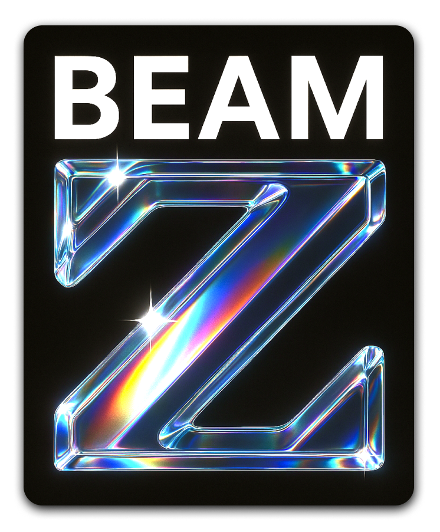

<div align="left">


BEAMZ is an **[electromagnetic](https://en.wikipedia.org/wiki/Electromagnetism) simulation** package using the **[FDTD](https://en.wikipedia.org/wiki/Finite-difference_time-domain_method) method**. It features a **high-level API** for fast prototyping with just a few lines of code, an **inverse design module** for topology optimization using the adjoint method with **Jax-based [autodiff](https://en.wikipedia.org/wiki/Automatic_differentiation)** and a thermal solver.
</div>

```bash
pip install beamz
```


## ✨ Core Features
- **100% Python**, free (MIT license) & open-source.
- Modular architecture with a high-level API.
- **GPU-accelerated** (but CPU-capable).
- Built-in layout flow (GDSII import/export).
- FDTD simulation in 2D and 3D.
- PML absorbing boundaries.
- Sub-pixel smoothing.
- Gaussian and mode sources with TE and TM polarization.
- Custom source time profiles.
- Monitors for field snapshots, power/Poynting history, and frequency-domain (DFT) accumulation.
- Single-frequency CW and broadband in-simulation DFT S-parameter extraction workflow.
- Dedicated visualization module for ...almost everything.
- Streamlined parametric design module.
- Thermal workflows (transient coupling + static thermal solves).
- Optimization/autodiff utilities for gradient-based **inverse-design** with Jax.


## 🚀 Example Library
Read and try out our **[example notebooks](https://quentinwach.com/beamz-notebooks/)** or download and run [`examples/` from this repository](https://github.com/QuentinWach/beamz/tree/main/examples).


---


## Planned / Work in Progress for v1.0.0
Much is in place already. The modules are established and the core features are working. Further development will hence focus on introducing more advanced EM physics and tooling. Please read `TODO.md` for a detailed list.


## About
BEAMZ's goal is to become the **pragmatic** FDTD engine of choice for **photonic chip designers**.

It focuses on **streamlined workflows** to produce **useful results** without tedious setup or configuration files. This is _not_ a research project with the goal to demo a novel framework we can publish, nor a costly, closed API that hides how it works and gives you no ownership. 

We are building in Python and choosing a **modular architecture** that is composable over a brutalist object-oriented architecture to **make the code readable and development easy**. So that, if there is something that isn't working or missing, you can quickly add it yourself!

This project is part of my long-term ambition to push towards something like COMSOL + Tidy3D, a programmatic, **differentiable multi-physics engine** for coupled electromagnetics + thermodynamics + charge carrier dynamics + mechanics (maybe even microfluidics) simulations and optimization of complex devices. Who doesn't dream of that? And I am wondering what devices AI could create with a tool like that, too.


## Contributing
If any of this excites you or if have any questions, please open an issue on GitHub!

Feel free to fork this project, to suggest or contribute new features. The WIP section contains a list of features that are planned to be implemented. Help is very much appreciated! That said, the easiest way to support the project is to **give this repo a ⭐!**

Thank you!
